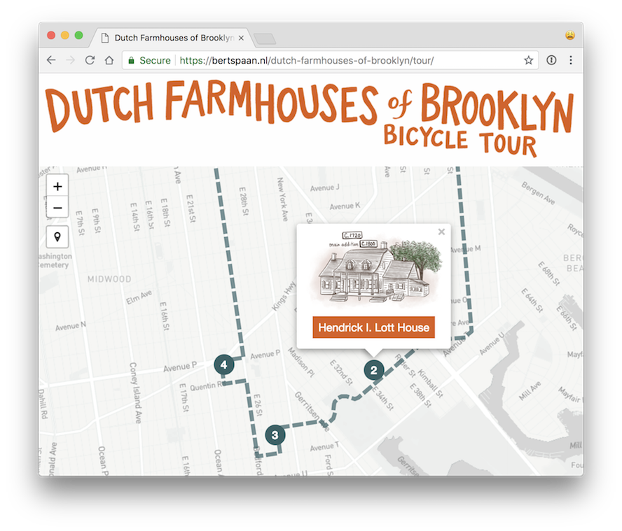

# Dutch Farmhouses of Brooklyn — by Bicycle!

This repository holds the website of [__Dutch Farmhouses of Brooklyn__](https://bertspaan.nl/dutch-farmhouses-of-brooklyn), a cycling tour of five historical Dutch farmhouses in Brooklyn. This website was used during a [meetup on May 12th, 2018](https://www.meetup.com/historical-data-and-maps-at-nypl/events/249151652/), but it’s also possible to use this website to do the tour later, by yourself (or to just read more about the Dutch history of Brooklyn).

Visit the website:

[__bertspaan.nl/dutch-farmhouses-of-brooklyn__](https://bertspaan.nl/dutch-farmhouses-of-brooklyn)

See below how to adapt the source code and use this website for your own walking or cycling tour.



The Meetup event was supported as part of the [Dutch Culture USA program](http://www.dutchcultureusa.com/) by the Consulate General of the Netherlands in New York.

## Adapting this website for a different walking or cycling tour

The cycling tour website is a [Jekyll](https://jekyllrb.com/) site, hosted on [GitHub Pages](https://pages.github.com/). To use this website for your own walking or cycling tour, do the following:

- [fork this repository](https://guides.github.com/activities/forking/);
- __make changes to some of the files__;
- serve the website on [GitHub Pages](https://pages.github.com/), or somewhere else.

The following files need to be adapted:

- [__`index.md`__](index.md): home page with introduction text
- [__`_config.yml`__](_config.yml): Jekyll [configuration file](https://jekyllrb.com/docs/configuration/), these configuration options need to be changed:

```yaml
title: Dutch Farmhouses of Brooklyn — by Bicycle!
   # Title of the website/tour
baseurl: /dutch-farmhouses-of-brooklyn
   # Base URL (part after domain name)
assetsurl: https://bertspaan.nl/dutch-farmhouses-of-brooklyn-assets/
   # URL where assets (such as images/maps/audio) is stored
   # (this is optional, can also be stored in repository itself)

parameters:
  max_distance: 8000
    # Distance in meters the map center
                     #
  map:
    tileUrl: "https://api.mapbox.com/styles/v1/nypllabs/cj2gmix25005o2rpapartqm07/tiles/256/{z}/{x}/{y}"
      # Leaflet tileUrl used in main route map
    attribution: "&copy; Mapbox, &copy; OpenStreetMap"
      # Map attribution

style:
  primary_color: "#de5f1b"
    # Primary color, used in CSS and on map
  secondary_color: "#346166"
    # Secondary color, used in CSS and on map
```

- [__`data/route.json`__](data/route.json): GeoJSON file containing the route; you can edit this file using [geojson.io](http://geojson.io/#data=data:text/x-url,https%3A%2F%2Fraw.githubusercontent.com%2Fbertspaan%2Fdutch-farmhouses-of-brooklyn%2Fmaster%2F_data%2Froute.json
)
- [__`_locations`__](_locations): this directory holds all the sites of the tour as Markdown files with [Jekyll front matter](https://jekyllrb.com/docs/frontmatter/):

```yaml
title: Elias Hubbard Ryder House
  # Title of the location
order: 3
  # Order of location in the tour
address: 1926 East 28th Street
  # Actual address (optional)
coordinates: [-73.9448224, 40.6042083]
  # Longitude/latitude of location
maps:
  # Optional list of maps (each with a title & tileurl)
  - title: Flatlands Beers Atlas of Long Island (1873)
    tileurl: http://maps.nypl.org/warper/maps/tile/9058/{z}/{x}/{y}.png  
audio:
  # Optional audio recording associated with location
fields:
  # Key/value fields, displayed on individual location pages
  # As many key/value pairs can be added - or none at all
  Constructed: c. 1834
  Builder: John Stillwell  
```

- [__`images`__](images):
  - [__`images/header.png`__](images/header.png): header image
  - [__`images/start.png`__](images/start.png) & [__`images/finish.png`__](images/finish.png): icons used at the start and end of the route, both 100x100 pixels
  - [__`images/locations/`__](images/locations/): images of locations used in the main route map, when a user clicks on one of the tour locations
- [__`README.md`__](README.md): this README file (optional, this does not affect the website itself)
